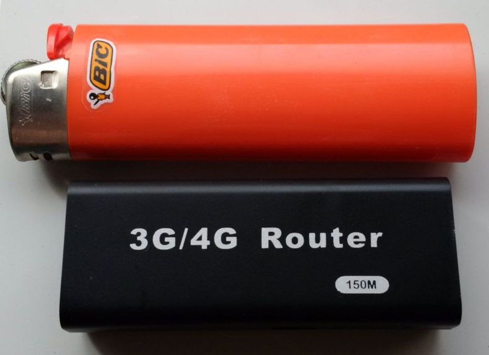

# OpenWRT Wireless attack mini-router

This is a custom OpenWRT image - CLI only - for the A5-V11 mini 3G router.

In order to bring life to this little project, basic soldering skills are required to upgrade the current eeprom SPI (flash chip) on the "A5-v11_3G_mini_router". Currently in 2023, this device can be obtained from ebay or aliexpress for around $8.

This little project allows the A5-V11 3G mini router to create an Access Point (SigDigA5V11) at boot, out of the box, becoming a Wireless swiss army tool that can be controlled from your phone running any SSH application.

Connect this access point with the password "Rockaway007$" (this is also the root password)

SSH to this Wireless attack gadget with the command:

ssh root@192.168.0.1

Once inside the device, if desired, change the wireless access point name and password. 

Enter to etc/config/wireless do the changes and reboot, done.

This image is loaded with the following features:
-
1.- Several wireless assesment tools.

aircrack-ng, airmon-ng, reaver, pixiewps, horst, tcpdump, rtl-sdr, rtl_433, rtl_ais, iodine, privoxy, hcxdumptool

Additional tools: 

netcat, fdisk, macchanger, nano, tmux

2.- Support for extension of the root and storage capacity with extroot (adding a USB flashdrive formated to ext4). Or just add a USB for simply more storage. For example, room for packet capture, target details, saved configs, tools output, other info, etc.

3.- Driver support for additional USB wireless cards adapters.
Devices based on chipset ar9271 (for instance DWA-126, WNA1100, TL-WN721N, TL-WN722N V1.x, TL-WN322G v3, TL-WN422G v2, DNUA-93F and anything azurewave and atheros ar9271) and also the chipset rt2800, for example the Ralink and Mediatek USB devices RT2770, RT2870, RT3070 RT3071, RT3072, RT3572.

4.- Wireless access point waiting for you to connect, ready to rock your attack. (Connect to SigDigA5V11)

# Installation requirements:

1.-We'll upgrade the mini router SPI eeprom capacity to 16MB with the chip "W25Q128". It can be found for a couple of bucks on aliexpress

https://www.aliexpress.us/item/3256804269088009.html

2.- The programer flasher ch341a with a clip adapter, which is very inexpensive and its supported for the awesome tool flashroom.

https://www.ebay.com/itm/285027193020

3.-An iron and solder

4.-A PC running linux

# Before anything (just in case):

We need to grab a copy of your original flash chip. We will not needed it for this project, but better safe than sorry. 
So, desolder/remove the flash chip from the mini router and connect it to the clip adapter from the ch341a programmer and follow below:

1.- These commands will install flashrom and  detect the original flash chip (and its number) you removed from the A5-V11 mini router:

sudo apt install flashrom

sudo flashrom -p ch341a_spi 

2.- This command will copy the original chip's content to a file

sudo flashrom -p ch341a_spi -c "your-flash-chip-name-detected-by-flashrom" -r original-fullflashchip-backup.bin 

# Building the firmware

0.-We need to prepare the OpenWRT build system. For Debian's derivatives install the following packages:

sudo apt update

sudo apt install build-essential clang flex bison g++ gawk gcc-multilib g++-multilib gettext git libncurses-dev libssl-dev python3 python3-distutils rsync unzip zlib1g-dev file wget

For other linux flavours follow this page for the setup:

https://openwrt.org/docs/guide-developer/toolchain/install-buildsystem

1.- Download the Image builder from openwrt.org (ramips 19.07.7)

wget https://downloads.openwrt.org/releases/19.07.7/targets/ramips/rt305x/openwrt-imagebuilder-19.07.7-ramips-rt305x.Linux-x86_64.tar.xz

2.- Unpack it and cd to openwrt

Once there, this is your chance to custom your root password, create a boot-access point, change access point name, change network configuration, add more or  less tools, or whatever else at your will (optional). 

For anything custom, you need mod and in some cases create the requiered files (for instance: network, wireless, shadow, etc) and place them inside a folder called 'files' (that also needs to be created)

Then, run the command:

make image -j2 V=s PROFILE="wt1520-8M" PACKAGES="-luci aircrack-ng airmon-ng ath9k-htc-firmware base-files block-mount busybox dnsmasq dropbear e2fsprogs ethtool fdisk firewall fstools fwtool getrandom hcxdumptool horst hostapd-common iodine ip6tables iptables iw-full jshn jsonfilter kernel kmod-ath kmod-ath9k-common kmod-ath9k-htc kmod-cfg80211 kmod-crypto-crc32c kmod-crypto-hash kmod-fs-ext4 kmod-gpio-button-hotplug kmod-ip6tables kmod-ipt-conntrack kmod-ipt-core kmod-ipt-nat kmod-ipt-offload kmod-leds-gpio kmod-lib-crc-ccitt kmod-lib-crc-itu-t kmod-lib-crc16 kmod-lib-crc7 kmod-mac80211 kmod-mii kmod-mmc kmod-mmc-spi kmod-nf-conntrack kmod-nf-conntrack6 kmod-nf-flow kmod-nf-ipt kmod-nf-ipt6 kmod-nf-nat kmod-nf-reject kmod-nf-reject6 kmod-nls-base kmod-ppp kmod-pppoe kmod-pppox kmod-rt2800-lib kmod-rt2800-mmio kmod-rt2800-soc kmod-rt2800-usb kmod-rt2x00-lib kmod-rt2x00-mmio kmod-rt2x00-usb kmod-slhc kmod-tun kmod-usb-core kmod-usb-ehci kmod-usb-net kmod-usb-net-cdc-ether kmod-usb-net-rndis kmod-usb2 libblkid1 libblobmsg-json libc libcomerr0 libevent2-7 libext2fs2 libfdisk1 libgcc1 libip4tc2 libip6tc2 libjson-c2 libjson-script libncurses6 libnl-core200 libnl-genl200 libnl-tiny libopenssl1.1 libpcap1 libpcre libpthread librt librtlsdr libsmartcols1 libss2 libtool-bin libubox20191228 libubus20210603 libuci20130104 libuclient20160123 libusb-1.0-0 libuuid1 libxtables12 logd macchanger mtd nano netcat netifd odhcp6c odhcpd-ipv6only openwrt-keyring opkg pixiewps ppp ppp-mod-pppoe privoxy procd procps-ng reaver rt2800-usb-firmware rtl-ais rtl-sdr rtl_433 swconfig tcpdump terminfo tmux ubox ubus ubusd uci uclibcxx uclient-fetch urandom-seed urngd usbutils usign wireless-regdb wireless-tools wpad-mini zlib" FILES="files"

If you need more details to build the image, refer to the Openwrt.org site and search info there.

https://openwrt.org/docs/guide-user/additional-software/imagebuilder

If compiling the image is too much of a process, the other option is to install the 'pre-made custom image' for this Wireless attack gadget project, located in the release section of this page.
-

# Firmware, Installation process:

1.- First, we need to create a blank canvas (named '16MBpadded.bin') of 16MB for the new flash chip.
running the following command:

 dd if=/dev/zero bs=1M count=16 of=16MBpadded.bin

2.- We will need a new Uboot for our Wireless attack gadget. (Thanks to Wert-Wert)

Get it from this site 
https://disk.yandex.com/d/ubSsjNZU34Xk2L 

Choose the file/image called 'Uboot_usb_256_03.img'

3.- Merge the new 'Uboot' image to the 16MB blank canvas you created in step 1.

Run the following command:  

dd if=Uboot_usb_256_03.img conv=notrunc of=16MBpadded.bin

After this, the file '16MBpadded.bin' will be ready and will include the 'new uboot' at the beginning of the 16MB.

 
4. Flash the now ready canvas (16MBpadded.bin) to the chip W25Q128

Grab the chip W25Q128, connect it to the flash programmer ch341a and run the command:

sudo flashrom -p ch341a_spi -c "your-flash-chip-name/number-detected-by-flashrom" -w 16MBpadded.bin

5. Solder the chip W25Q128 to the mini router.
   

6.- Get a USB flash drive formated to FAT32.

Get the Custom OpenWRT image you built or grab the pre-made image from the release section of this page. 

Then place it on the root directory of the USB flash drive.

7.- Connect the USB to your device.

While holding the reset button, power the A5-V11 device. (keep holding the reset button for 10 seconds, then release the button).
Your USB flash drive will light up and the OpenWRT custom image will be installed/flashed. Leave your device alone for a minute or two. 

8.- Now, your Wireless attack gadget is ready. Connect to the access point. 

Go nearby an Ecorp building (wink- wink)

# Disclaimer

Usage of the OpenWRT-Wireless_attack-gadget for attacking infrastructures without prior mutual agreement and consent can be considered as an illegal activity. It is the final user's responsibility to obey all applicable local, state and federal laws. Authors assume no liability and are not responsible for any misuse or damage caused by this program.

